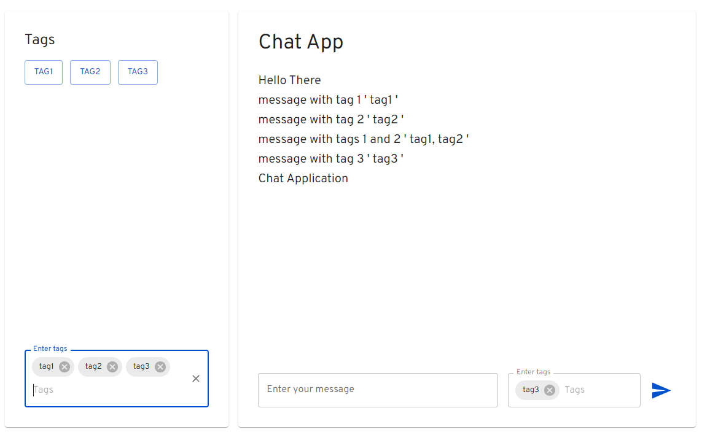

# Chatting App

Welcome to the Chat Application! This platform allows users to engage in real-time chat without the need for registration or authentication. Users can send messages with specified tags.

## Features

- **No Registration Required**: Users can start chatting immediately without the need for registration or authentication.
- **Dark and Light Modes**:The Chat Application offers both dark and light modes for a personalized user experience. Users can switch between these modes based on their preference. 
- **Message Tagging**: Users can send messages with specific tags to categorize their content.
- **Tags Panel**: On the left side, users can enter and manage the set of tags they have enabled. Tags can be added or removed by clicking.
- **Tag-Based Message Filtering**: In the chat display, users will only see messages that are marked with tags enabled in their tags panel. Tags act as message filters.
- **Message Persistence**: All messages are stored in the database indefinitely, making previously sent messages visible when users enter the site.
- **Messages Without Tags**: Messages without tags are always visible, regardless of tag-filter configurations.
- **Real-Time Messaging**: Messages sent by users appear immediately for all other users, creating a real-time chat experience.
- **Auto-Scrolling**: The message box automatically scrolls down to display new messages when received.
- **Resonsive-Design**: The Chat Application is designed with a responsive layout, ensuring that it looks and functions well on various devices, including desktops, tablets, and mobile phones.

## Technology Stack

- **Frontend**: ReactJS, Material-UI (mui)
- **Backend**: Node.js, Express.js, Socket.IO
- **Database**: MySQL, Sequelize for ORM

## How to Use

1. Open the Chat Application.
2. Wait for the server connection to establish.
3. On the right side, enter your message and select the tags you want to associate with it.
4. On the left side, manage your "my tags" panel by adding or removing tags for filtering messages.
5. Messages will appear in the chat display based on the selected tag-filter configuration.
6. Enjoy real-time chat and interaction with other users.

## Links

- GitHub Repository: [github.com/abramishvilisaba/chatting-app](https://github.com/abramishvilisaba/chatting-app)
- Live Demo: [chat-app-wml0.onrender.com](https://chat-app-wml0.onrender.com)

## Author

- GitHub: [abramishvilisaba](https://github.com/abramishvilisaba)

## Contributing

Contributions to this project are welcome! If you find a bug or have suggestions for improvements, please feel free to open an issue or submit a pull request.
